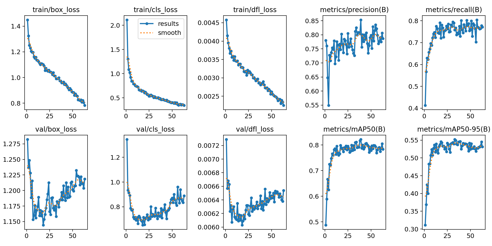
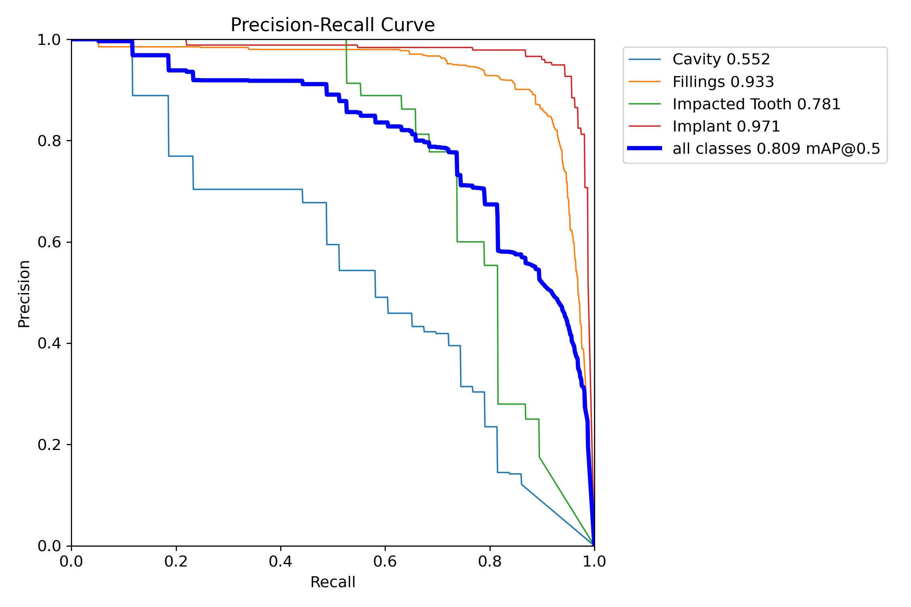
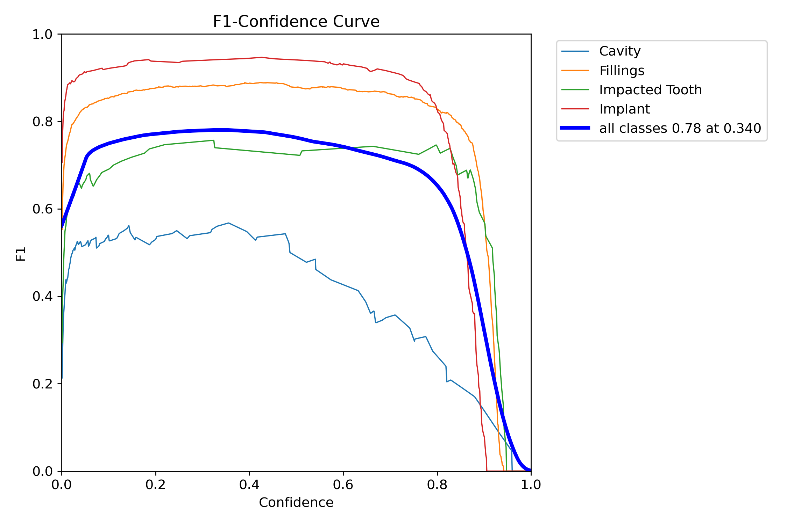
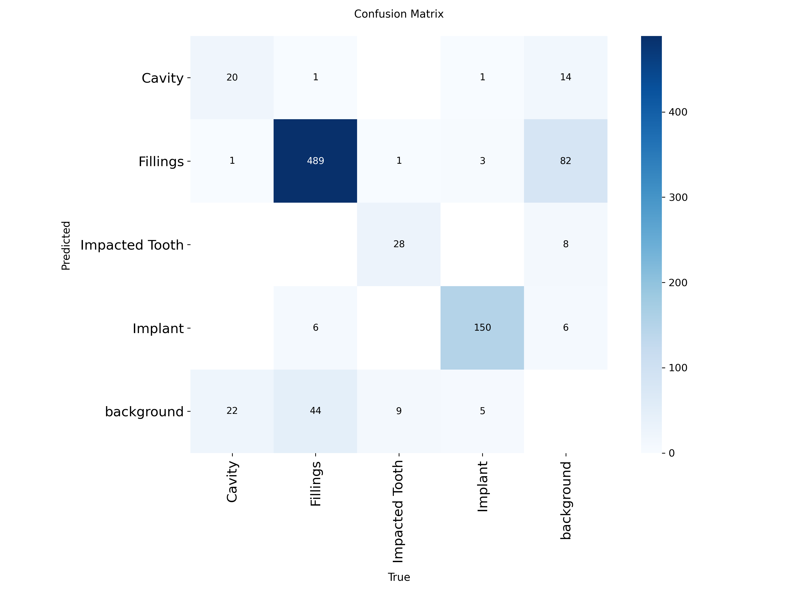
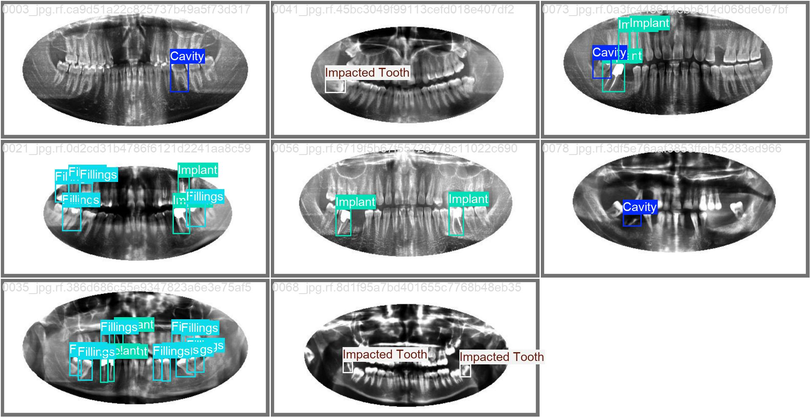
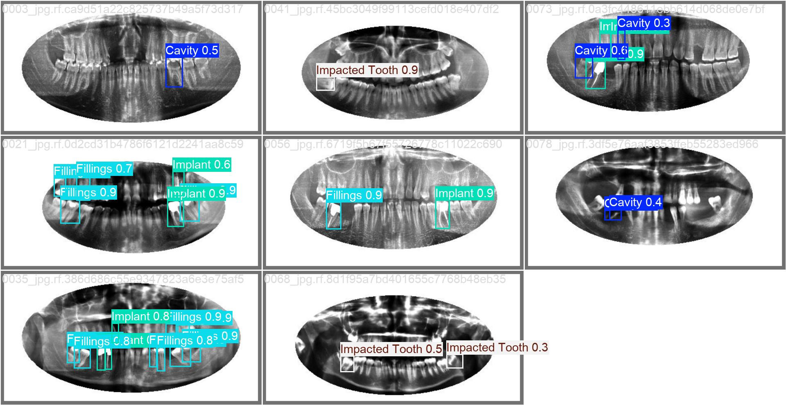
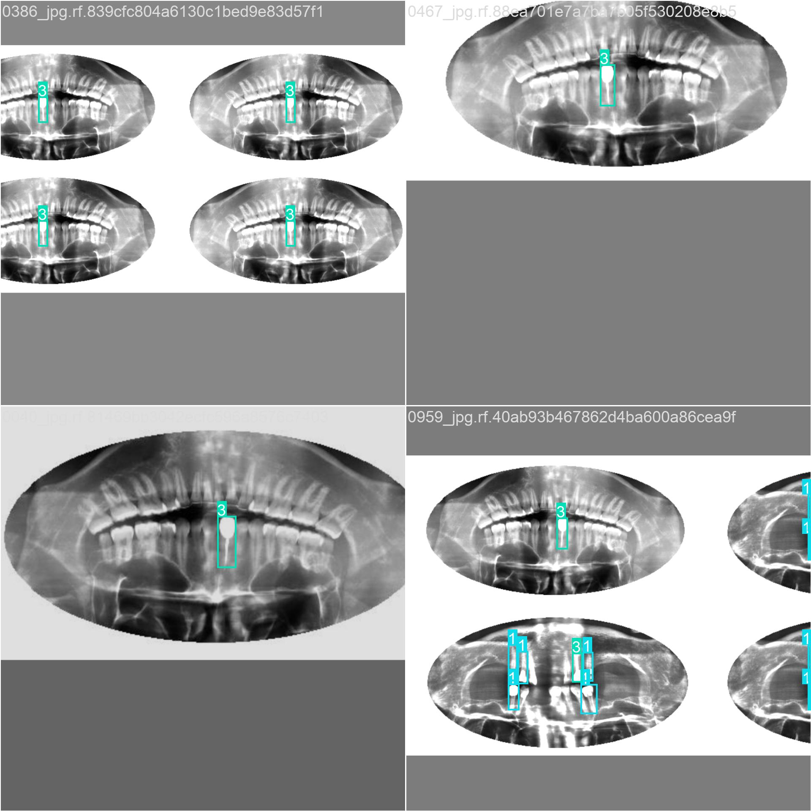

# 📚 Estudio del Código y Evolución del Entrenamiento YOLOv8

> [!NOTE]
> Este documento sirve como guía de estudio para comprender la arquitectura de scripts desarrollada en el proyecto y resumir las fases de experimentación y *fine-tuning* extraídas de la documentación de pruebas.

---

## 🤖 Tipo de Entrenamiento Utilizado

Para que la Inteligencia Artificial aprenda a detectar problemas dentales, se han combinado conceptos clave de Machine Learning basándose en **Redes Neuronales**:

1. **Redes Neuronales Convolucionales (CNN) y *Deep Learning*:** Sí, el núcleo de todo este sistema es una **Red Neuronal Profunda**. Específicamente, YOLOv8 (*You Only Look Once*) es una arquitectura avanzada de redes convolucionales, que son un tipo de redes neuronales especializadas en "ver" y entender imágenes. Funcionan pasando la radiografía por docenas de capas matemáticas (filtros) que extraen desde formas simples (bordes de los dientes) hasta patrones muy complejos (la textura sutil de una caries).
2. **Detección de Objetos (*Object Detection*):** A diferencia de la clasificación genérica (que solo dice "esto es una radiografía"), la red neuronal YOLO se entrena para predecir **coordenadas exactas** (cajas delimitadoras o *bounding boxes*) dentro de la imagen y asignarles una etiqueta específica (caries, implante, etc.).
3. **Aprendizaje Supervisado (*Supervised Learning*):** La red neuronal no aprende por sí sola. Requiere que un experto humano le proporcione la "verdad absoluta" (las etiquetas del archivo CSV convertidas a `.txt`). El modelo predice, compara su predicción con la etiqueta humana, calcula su margen de error (*Loss Function*) y ajusta sus matemáticas internas para equivocarse menos la próxima vez.
4. **Aprendizaje Transferido y Fine-Tuning (*Transfer Learning*):** En lugar de entrenar la red desde cero con neuronas de pesos aleatorios (lo cual requeriría millones de radiografías), partimos de una red neuronal pre-entrenada (`yolov8n.pt` o `yolo26m.pt`). Estas redes ya son expertas en visión artificial general y saben identificar bordes, contrastes y texturas. Durante las fases de **Fine-Tuning**, "descongelamos" sus capas finales o alteramos suavemente su tasa de aprendizaje para re-especializar ese conocimiento visual genérico hacia el dominio específico médico (odontología radiográfica).

---

## 🛠️ 1. Arquitectura del Código (`tools/`)

El conjunto de herramientas en la carpeta `tools` está diseñado para facilitar, automatizar y estandarizar el flujo de trabajo con YOLOv8, desde la preparación de datos hasta la evaluación de resultados.

### 📄 1.1 `csv_to_yolo.py`
**Propósito:** Convierte anotaciones de bounding boxes desde un formato tabular (CSV) al formato de texto plano requerido por YOLOv8 (`.txt` por cada imagen).
**Funcionamiento:**
- Lee el CSV y detecta las clases dinámicamente (`collect_classes`).
- Convierte y normaliza las coordenadas absolutas (xmin, ymin, xmax, ymax) a coordenadas relativas al centro (`x_center`, `y_center`, `width`, `height`) esperadas por YOLO.
- Comprueba si las imágenes referenciadas en el CSV realmente existen en disco.
- Genera el archivo `data.yaml` necesario para que Ultralytics entienda la estructura del dataset.
- Escribe un `conversion_report.json` con estadísticas de la conversión (cajas válidas, filas inválidas, etc.).

### 🧠 1.2 `train_yolov8.py`
**Propósito:** Script principal para lanzar entrenamientos de YOLOv8 ofreciendo control total sobre parámetros avanzados de *fine-tuning*.
**Funcionamiento:**
- Recoge argumentos clave como `--epochs`, `--imgsz`, `--batch`, `--device` y `--model`.
- Implementa flags avanzados para evitar el sobreajuste (*overfitting*) en datasets pequeños: `--freeze` (para congelar capas base), `--lr0` (tasa de aprendizaje), `--dropout`, `--weight-decay`, etc.
- **Soporte para Tuning:** Incluye la bandera `--tune` que lanza un algoritmo genético de mutación de hiperparámetros de Ultralytics para buscar la mejor configuración de *Data Augmentation*.
- Permite inyectar un archivo de configuración externo (como `best_hyperparameters.yaml`) a través del flag `--cfg`.

### 📊 1.3 `eval_predict_yolov8.py`
**Propósito:** Evaluar un modelo entrenado sobre el conjunto de validación o lanzar predicciones masivas sobre nuevas imágenes/videos.
**Funcionamiento:**
- Puede operar en modo `val` (solo métricas), `predict` (solo inferencia visual) o `both` (ambos).
- Ejecuta inferencia configurando umbrales como `--conf` (confianza mínima) y `--iou` (para el *Non-Maximum Suppression*).
- **Extracción de Métricas:** Atrapa los resultados y los formatea automáticamente en `val_metrics.json` y `val_metrics.csv`.
- Guarda un `run_report.json` con toda la trazabilidad de la ejecución.

### ⚙️ 1.4 `run_train_eval_predict_yolov8.py`
**Propósito:** Pipeline automatizado. Orquesta el flujo completo de entrenamiento y evaluación secuencialmente.
**Funcionamiento:**
- Llama de forma programática a `train_yolov8.py` mediante un subproceso.
- Al terminar el entrenamiento, busca automáticamente los mejores pesos (`best.pt` o `last.pt`).
- Pasa esos mejores pesos a `eval_predict_yolov8.py` para sacar las métricas finales.

### 🖥️ 1.5 `device_resolver.py`
**Propósito:** Utilidad auxiliar para detectar y asignar correctamente la GPU o CPU.

---

## 🔬 2. Pasos y Evolución del Fine-Tuning

Basado en la bitácora de pruebas, el entrenamiento ha pasado por múltiples iteraciones intentando maximizar la detección de patologías difíciles en un dataset limitado, sin desbordar la memoria VRAM.

### 🧊 Fase 1: Encontrando el equilibrio entre Freeze 10 y Freeze 5
- **Problema inicial:** El modelo base `dental_yolov8` sufría de sobreajuste temprano (época 52) y era muy "agresivo" (muchos falsos positivos).
- **Prueba 1 (`dental_yolo26n_laptop`):** Se aplicó `--freeze 10` y un learning rate suave. Resultó en un aprendizaje más estable hasta la época 119 y redujo drásticamente falsas alarmas, pero se volvió muy conservador.
- **Prueba 2 (`dental_yolo26n_laptop_freeze5`):** Al reducir a `--freeze 5`, la red pudo adaptarse un poco más a las radiografías. Subió el mAP50 a **72.2%** y balanceó perfectamente Precisión vs Recall.

### 🎯 Fase 2: Exprimir el dataset con YOLO "Nano"
Se lanzaron 3 estrategias simultáneas para mejorar la detección de **Caries** (la clase más problemática):
1. **Regularizado (`dental_regularizado`):** Uso de Dropout y Weight Decay para evitar memorización. El exceso de regularización frenó el aprendizaje (mAP50 73.1%).
2. **Alta Resolución (`dental_alta_resolucion`):** Subir `imgsz=1024` bajando el batch a 4. Excelente en empastes e implantes, pero penalizado en estabilidad de gradientes por el batch pequeño.
3. **Cero Freeze Suave (`dental_nofreeze_suave`):** Ninguna capa congelada, pero con un aprendizaje ultra-suave. **Fue el claro ganador** con un mAP50 de **75.5%** y la mejor detección de caries (mAP50 41.2%).

### 🚀 Fase 3: Escalar la Arquitectura (Nano vs Medium)
Al agotar el potencial del modelo Nano, se dio el salto a la arquitectura Medium (`yolo26m.pt`) manteniendo la configuración de la mejor prueba.
- **Resultado (`dental_nofreeze_suave_yolo26m`):** El salto fue monumental. Alcanzó un mAP50 de **82.19%** en tan solo 39 épocas. 

### 🧬 Fase 4: Tuning de Hiperparámetros (Mutación)
Para exprimir el modelo Medium al máximo, se ejecutó una búsqueda automatizada de hiperparámetros.
- **Comando:** Uso de `--tune` y `--iterations 10` con el modelo Medium a `imgsz=640` (por velocidad).
- **Resultados de `dental_tuning_medium_hiperparametros`:** 
  A pesar de haber entrenado durante ciclos extremadamente cortos de **solo 15 épocas** (lo cual habitualmente no es suficiente para que un modelo alcance su madurez), esta configuración mutada logró unos resultados impresionantes:
  - **mAP50:** `0.8034` (80.34%)
  - **mAP50-95:** `0.5575` (55.75%)
  
  Conseguir superar la barrera del 80% en tan pocas épocas demostró matemáticamente que la combinación de variaciones de imagen (rotaciones, oscurecimientos) generada era la "fórmula perfecta" para acelerar el aprendizaje en este dataset clínico, produciendo así el codiciado archivo `best_hyperparameters.yaml`.

> [!WARNING]
> **Aclaración sobre esta carpeta:**
> Los pesos (`.pt`) guardados en esta carpeta **no** son un modelo finalizado ni deben usarse en producción para hacer diagnósticos. Son simplemente un subproducto temporal de estos miniciclos experimentales de 15 épocas. El verdadero "tesoro" que se debe extraer y conservar de esta prueba es únicamente la "receta" guardada en el archivo `best_hyperparameters.yaml`.

> [!TIP]
> ### 🏆 Fase Final: El "Super Modelo" Definitivo
> Para culminar todo el aprendizaje, se configuró el entrenamiento final inyectando el archivo de hiperparámetros obtenido del *tuning*:
> - Modelo: `yolo26m.pt`
> - Resolución: `imgsz 1024`
> - Batch: `8` (o máximo posible sin OOM)
> - Hiperparámetros: Inyectados vía `--cfg best_hyperparameters.yaml`.

---

## 🔍 3. Profundización en Componentes Clave del Código

### 📏 3.1 Conversión y Escalado de Coordenadas (`csv_to_yolo.py`)

Uno de los retos al entrenar YOLO es que no entiende coordenadas absolutas (píxeles), sino **coordenadas normalizadas al centro**. El script `csv_to_yolo.py` incluye una función llamada `row_to_box()` que se encarga específicamente de esta tarea matemática de forma segura.

> [!WARNING]
> **Corrección Defensiva (Clipping):** Si alguna coordenada de la caries se sale ligeramente de los límites de la imagen (por un error humano al etiquetar en el CSV), el script la recorta usando `min()` y `max()` para evitar que YOLO falle durante el entrenamiento.

**Normalización (0 a 1):** Calcula la anchura y altura real de la caja, así como su punto central exacto. Luego, divide todo entre las dimensiones de la imagen.
```python
width = (xmax - xmin) / img_w
height = (ymax - ymin) / img_h
x_center = ((xmin + xmax) / 2.0) / img_w
y_center = ((ymin + ymax) / 2.0) / img_h
```
*Resultado:* Una caries que estaba en los píxeles (100, 200) pasa a representarse como `(0.125, 0.250)` respecto al tamaño total.

### 💉 3.2 Inyección de Hiperparámetros (`train_yolov8.py`)

Durante la fase de *tuning*, Ultralytics descubre qué tanta probabilidad de rotación, alteración de color o traslación necesita la red. Esa "receta secreta" queda guardada en un `best_hyperparameters.yaml`.

> [!IMPORTANT]
> **Filtrado de Colisiones:** No todos los hiperparámetros del archivo YAML deben sobreescribirse ciegamente. El script filtra inteligentemente claves que podrían chocar con tu comando de terminal (como `device`, `epochs` o `batch`), garantizando que si le dices a consola `--epochs 150`, el YAML no lo sobreescriba por error.

**Actualización (Inyección):** Actualiza el diccionario de configuración final (`train_kwargs`) con los parámetros refinados, pasándole a `model.train(**train_kwargs)` una configuración mutada.

---

## 📈 4. Interpretación de los Artefactos Gráficos (Carpeta `runs/`)

Cada vez que YOLO finaliza un entrenamiento o evaluación, genera una serie de gráficos e imágenes en la carpeta `runs/train/nombre_experimento/`. Aprender a leerlos es vital para saber si el modelo va por buen camino o si tiene problemas. A continuación se muestran ejemplos reales del entrenamiento `dental_nofreeze_suave_yolo26m`.

### 📉 4.1 Gráficos de Rendimiento y Curvas
- **`results.png`:** Es el "electrocardiograma" del entrenamiento. Muestra 10 gráficas distintas.
  > [!CAUTION]
  > *Cómo leerlo:* Quieres ver que las curvas de pérdida (*loss*) bajan suavemente y que las curvas de métricas suben y se estabilizan. Si el *loss* de validación (*val/box_loss*) empieza a subir de repente mientras el de entrenamiento baja, tienes **sobreajuste (overfitting)**.
  
  

- **`PR_curve.png` (Curva Precision-Recall):** Muestra el equilibrio entre no fallar (Precision) y encontrarlo todo (Recall) para cada clase. Cuanto más "abombada" hacia la esquina superior derecha esté la curva, mejor es el modelo.
  
  

- **`F1_curve.png`:** Combina Precision y Recall en una sola métrica. El punto más alto de la curva te indica el nivel de confianza (umbral `--conf`) óptimo.
  
  

### 🖼️ 4.2 Matrices y Visualizaciones de Detección
- **`confusion_matrix.png`:** Una tabla que cruza lo que el modelo predijo frente a lo que realmente era.
  > [!NOTE]
  > *Cómo leerlo:* La diagonal principal representa los aciertos. Si ves números altos fuera de esa diagonal, significa que el modelo confunde ciertas clases (ej. confundir un empaste con una caries).
  
  

- **`val_batch*_labels.jpg` vs `val_batch*_pred.jpg`:** Imágenes de radiografías de validación. El archivo `labels` muestra dónde están los problemas reales, y el `pred` muestra lo que dibujó la IA.
  
  **Realidad (Labels) vs Predicción de IA:**
  
  

- **`train_batch*.jpg`:** Muestra las imágenes exactas (con mosaicos, rotaciones, recortes, oscurecimientos) con las que se está alimentando la red.
  > [!WARNING]
  > Ideal para auditar el *Data Augmentation*. Si aquí ves radiografías tan distorsionadas que ni siquiera tú (el experto) puedes identificar la caries, el modelo tampoco podrá aprender.
  
  
